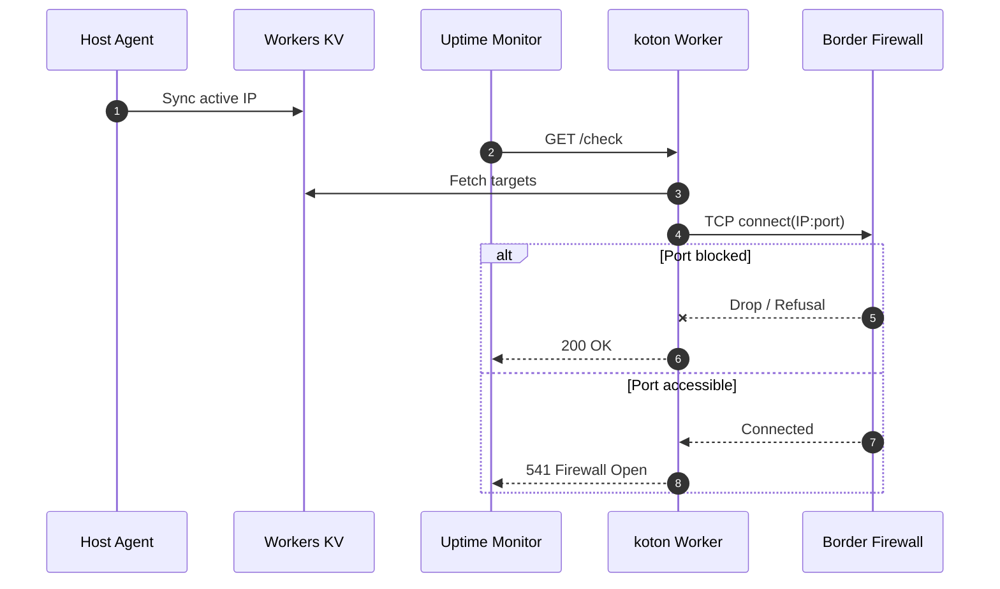

# koton

Out-of-band firewall watchdog powered by Cloudflare Workers (named after [K9 Koton](https://www.theguardian.com/books/gallery/2020/feb/02/hollywood-hounds-canine-film-stars-in-pictures#img-12)). Intended for monitoring that IPv6 GUAs are outbound only from private networks.

## Usage
A worker probes public IPv6 addresses from Cloudflare (on GET `/check`) verifying that connection attempts are dropped or refused. A Python script pushes up GUAs to the worker from internal hosts periodically.

## Architecture


---
## Status Codes

| HTTP Status | State | Description |
|:---:|:---|:---|
| **`200`** | **Healthy** | All ports dropped or refused. |
| **`541`** | **Firewall Open** | External TCP connection succeeded (uh oh). |
| **`540`** | **No Targets** | Target list empty in KV. |

```json
{
  "ok": true,
  "ipsLastPushed": { "node-01": "2026-08-31T15:00:53Z" },
  "open": [],
  "errors": [...],
  "results": [...]
}
```

---

## Quick Start

### 1. Worker Setup

```bash
git clone https://github.com/rhargreaves/koton.git && cd koton
npm install
npx wrangler kv namespace create KOTON
```

Set the generated KV ID in `wrangler.toml`, then deploy:

```bash
npm run deploy
```

---

### 2. Host Agent Setup

1. Copy `client/push-gua.py` to `/opt/koton/push-gua.py`.
2. Configure credentials in `/opt/koton/env` (`chmod 0600`):
   ```env
   CF_API_TOKEN=your_token_with_kv_write
   CF_ACCOUNT_ID=your_account_id
   CF_KV_NAMESPACE_ID=your_kv_namespace_id
   ```
3. Enable systemd timer:
   ```bash
   cp client/systemd/koton.* /etc/systemd/system/
   systemctl daemon-reload
   systemctl enable --now koton.timer
   ```

---

### 3. Monitoring

Add an HTTP check (e.g. Uptime Kuma) against:
```
https://koton.<your-subdomain>.workers.dev/check
```

Alert on anything other than `200`.

---

## Configuration

Set in `wrangler.toml`:
- `PORT_LIST`: Comma-separated TCP ports to probe (e.g. `"22,80,443"`).
- `PROBE_TIMEOUT_MS`: Probe timeout in ms (default: `5000`).

---

## License

[MIT](LICENSE)
